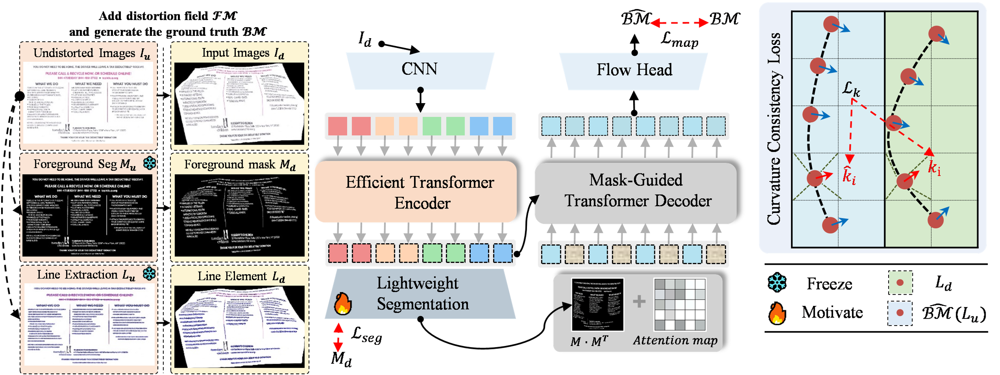

    <h2>ForCenNet: Foreground-Centric Network for Document Image Rectification</h2>

    <a href="https://github.com/caipeng328/ForCenNet" target='_blank'>Peng Cai</a>&emsp;
    <a href='https://github.com/caipeng328/ForCenNet' target='_blank'>liqiang</a>&emsp;
    <a href='https://github.com/caipeng328/ForCenNet' target='_blank'>Kaicheng Yang</a>&emsp;
    <a href='https://github.com/caipeng328/ForCenNet' target='_blank'>guodong</a>&emsp;
    <a href='https://github.com/caipeng328/ForCenNet' target='_blank'>lijia</a>&emsp;
    <a href='https://github.com/caipeng328/ForCenNet' target='_blank'>zhounan</a>&emsp;
    <a href='https://github.com/caipeng328/ForCenNet' target='_blank'>Xiang An</a>&emsp;
    <a href='https://github.com/caipeng328/ForCenNet' target='_blank'>Ninghua Yang</a>&emsp;
    <a href='https://github.com/caipeng328/ForCenNet' target='_blank'>Jiankang Deng†</a>

    

---

### ✅ TODO
- [ ] Release the rectification results on four datasets.
- [ ] Release a callable Web UI demo.

## 🎃 Overview

